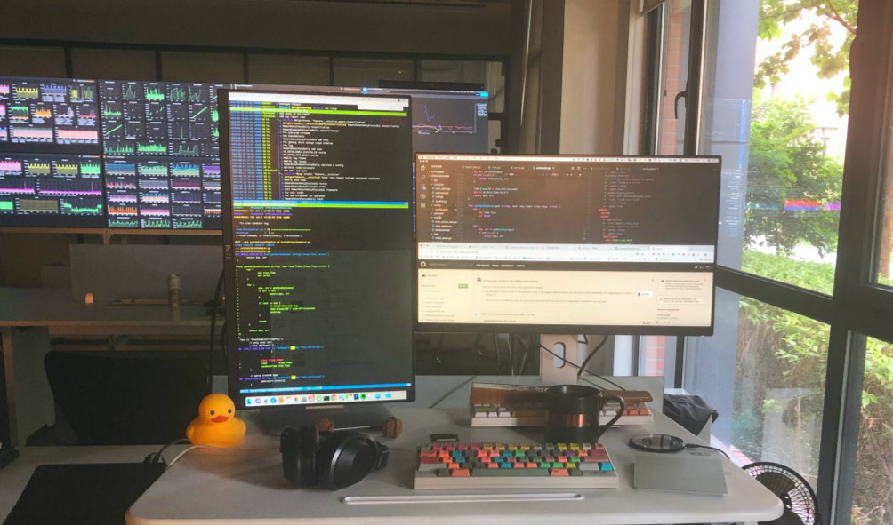
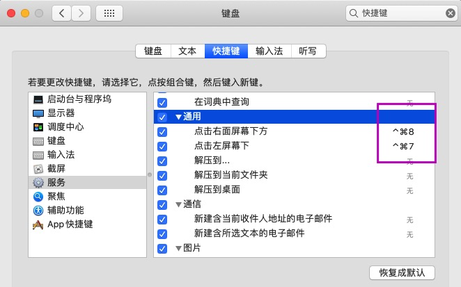

# multi-screen-jump

当你有多个外接屏幕需要屏幕焦点切换时... 不一样的应用, 可通过alfred按照应用名字来调到前台，但左右屏幕是同一种应用.

下面提供两种多屏焦点的切换方法.

### 基于alfred的工作流 (强烈推荐)

直接双击走import流程, 在alfred输入指令

* zuo, 跳到左屏幕并点击
* you, 跳到右屏幕并点击
* zx, 跳到左下方屏幕
* yx, 跳到右下方屏幕

### 基于mac automator自动工作流

系统偏好设计 > 键盘 > 快捷键 > 服务

